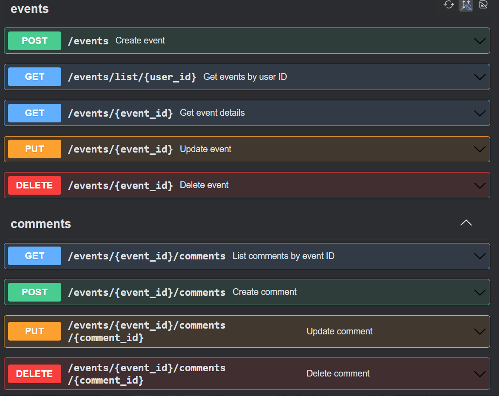
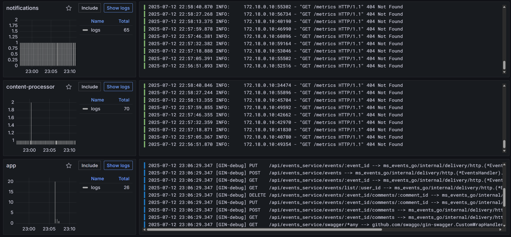
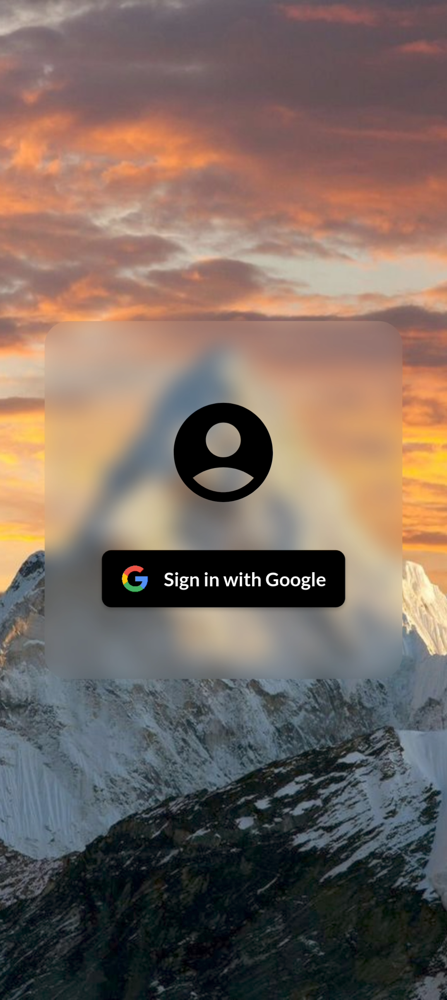
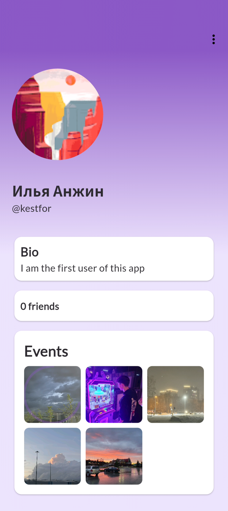
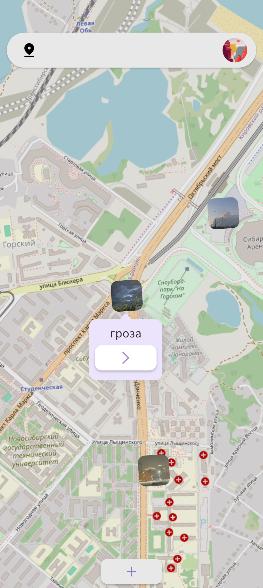
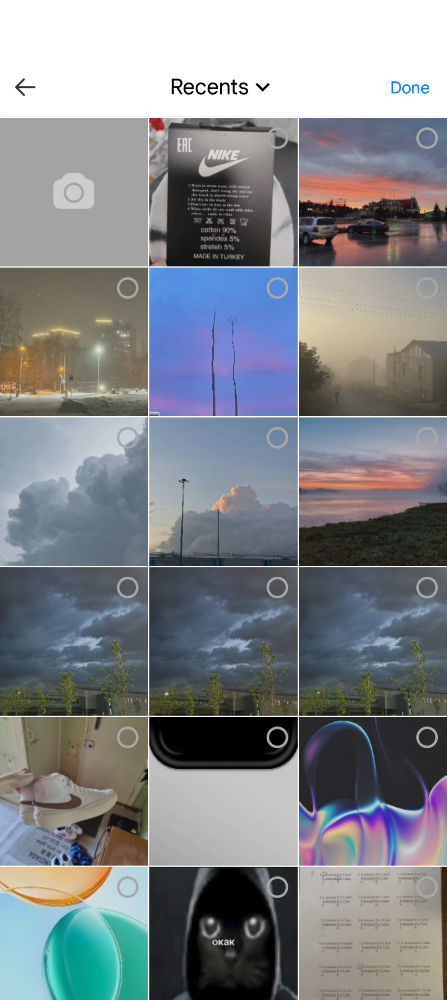
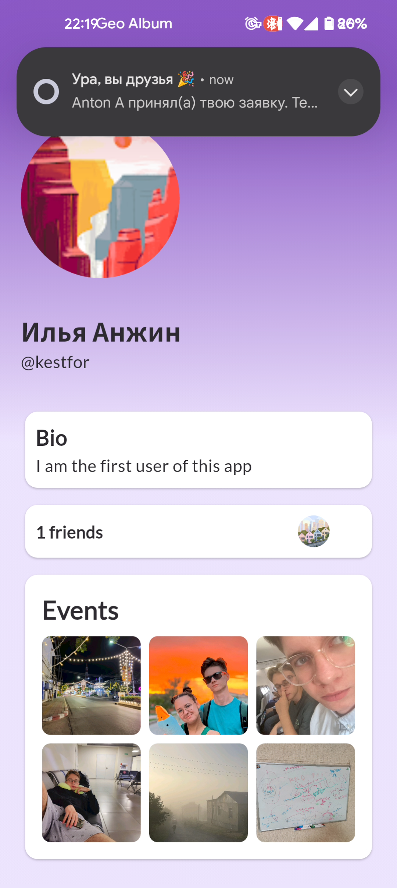
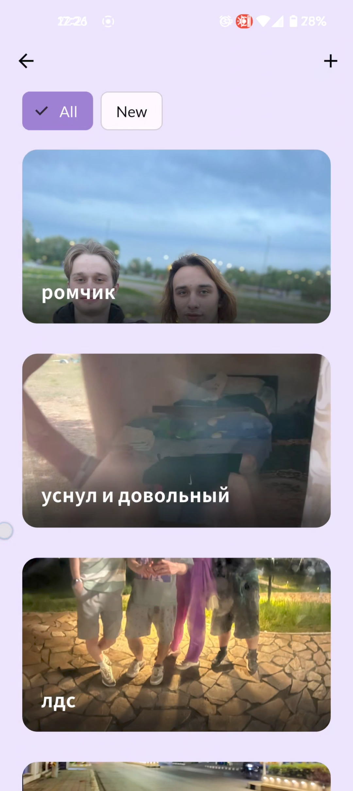
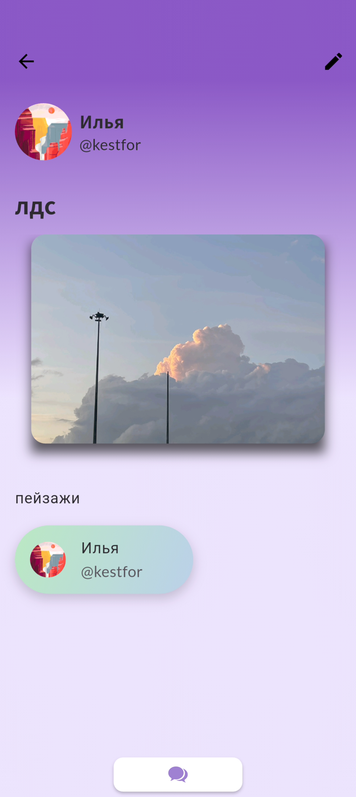

# GeoAlbum

Мобильное приложение в рамках учебного проекта по командной разработке продукта для обмена медиа-контентом среди друзей
на карте мира с микросервисной архитектурой на стороне сервера и кросплатформенным flutter приложением на стороне
конечного пользователя

## Структура проекта

```
.
├── .github/
│   ├── readme_images/     # Скриншоты для документации
│   └── workflows/         # GitHub Actions конфигурации (CD)
├── gateway/               # API Gateway для маршрутизации запросов (nginx)
├── mobile_app/            # Мобильное Flutter-приложение для обмена медиа-контентом
├── ms_users/              # Микросервис управления пользователями (java)
├── ms_events/             # Микросервис управления мероприятиями (Legacy, java)
├── ms_events_go/          # Новый микросервис управления мероприятиями (golang)
├── content_processor/     # Сервис обработки медиа-контента (python)
├── notification_backend/  # Сервис уведомлений (python)
├── observability/         # Инструменты мониторинга и логирования
└── start.sh               # Скрипт запуска всех сервисов
```

### Основные микросервисы имеют swagger документацию по пути /docs



### Observability сервис доступен через grafana по порту 3000



## Компоненты системы

### Gateway

API Gateway служит единой точкой входа для всех клиентских запросов и обеспечивает:

- Маршрутизацию запросов к соответствующим микросервисам
- Аутентификацию и авторизацию
- Rate limiting

### Mobile App

Мобильное приложение для пользователей системы.

#### Основные экраны приложения:

<table>
  <tr>
    <td align="center">
      <p><strong>Экран входа</strong></p>
      
    </td>
    <td align="center">
      <p><strong>Профиль пользователя</strong></p>
      
    </td>
  </tr>
  <tr>
    <td align="center">
      <p><strong>Карта контента</strong></p>
      
    </td>
    <td align="center">
      <p><strong>Выбор медиа-контента</strong></p>
      
    </td>
  </tr>
  <tr>
    <td align="center">
      <p><strong>Уведомления</strong></p>
      
    </td>
    <td align="center">
      <p><strong>Список созданных событий</strong></p>
      
    </td>
  </tr>
  <tr>
    <td align="center">
      <p><strong>Экран события</strong></p>
      
    </td>
    <td></td>
  </tr>
</table>

### Микросервисы

#### MS Users

Микросервис управления пользователями отвечает за:

- Регистрацию и аутентификацию пользователей
- Управление профилями
- Взаимодействие между пользователями

#### MS Events (Legacy)

Старая версия микросервиса управления событиями.

#### MS Events Go

Новая версия микросервиса управления мероприятиями, написанная на Go. Обеспечивает:

- CRUD операции с событиями
- CRUD операции с комментариями событий

#### Content Processor

Сервис обработки контента выполняет:

- Валидацию загружаемых файлов
- Хранение медиа-контента через aws

#### Notification Backend

Сервис уведомлений обеспечивает:

- Push-уведомления через google firebase
- Управление подписками на уведомления

### Observability

Компоненты для мониторинга и отладки:

- Системы логирования
- Метрики производительности
- Трейсинг запросов
- Алертинг

## Запуск проекта

Для запуска всех компонентов системы используется скрипт `start.sh`

## Контрибьютеры

Ниже приведен список участников, внесших вклад в различные компоненты системы:

### Gateway - https://github.com/kestfor

### Mobile App - https://github.com/kestfor

### MS Users - https://github.com/JsJustS

### MS Events (Legacy) - https://github.com/nextples

### MS Events Go - https://github.com/kestfor

### Content Processor - https://github.com/AntonAdonin

### Notification Backend - https://github.com/AntonAdonin

### Observability - https://github.com/AntonAdonin

Изначальные наброски, user-story, agile story и др. доступны на доске: https://miro.com/app/board/uXjVIZNGeJc=/
