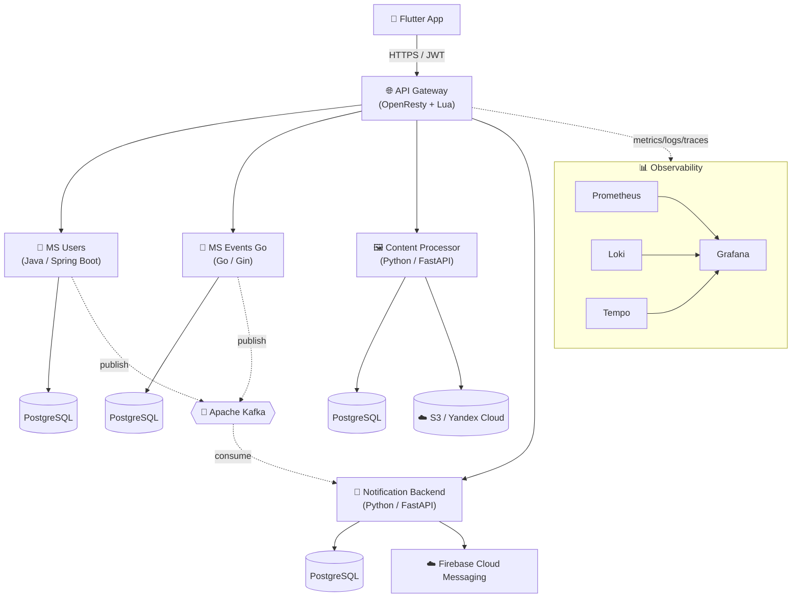
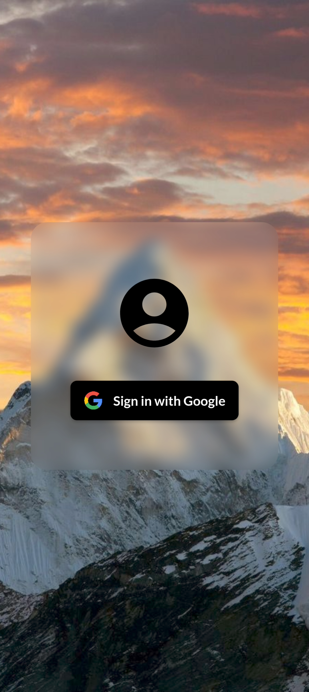
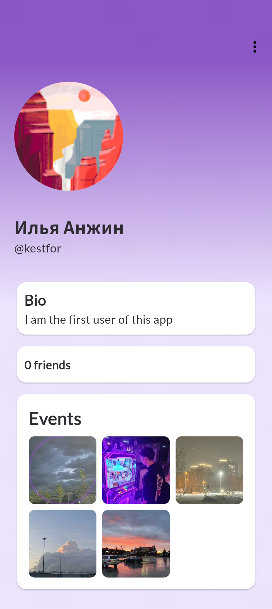
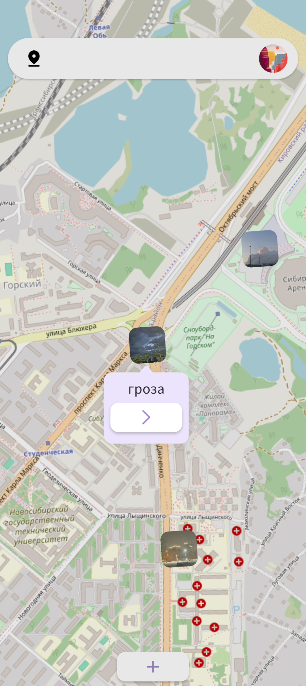
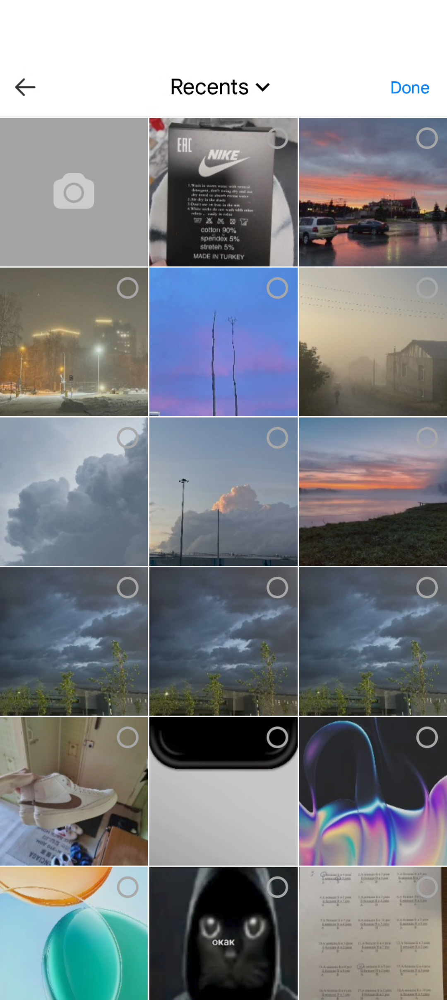
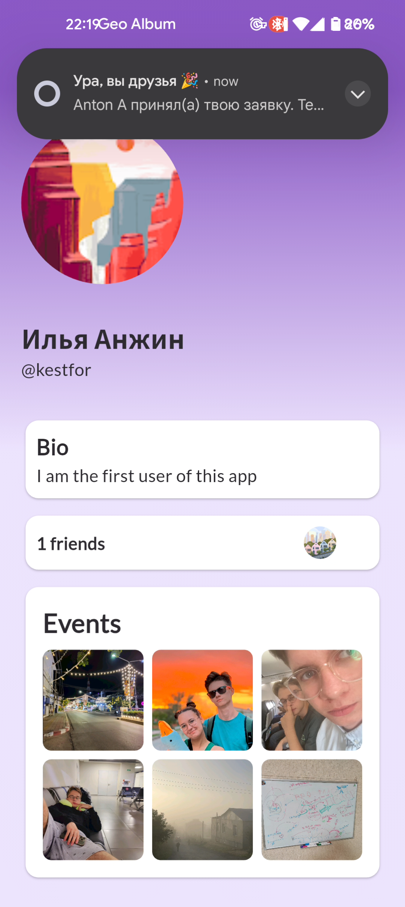
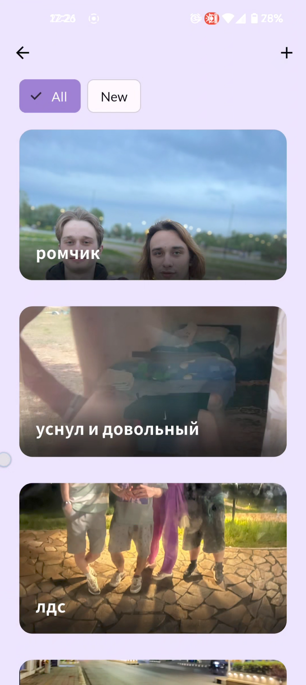
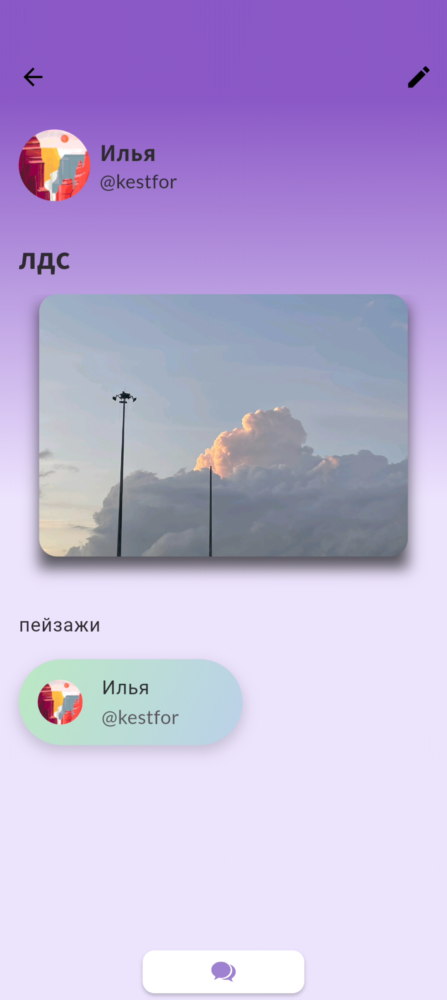
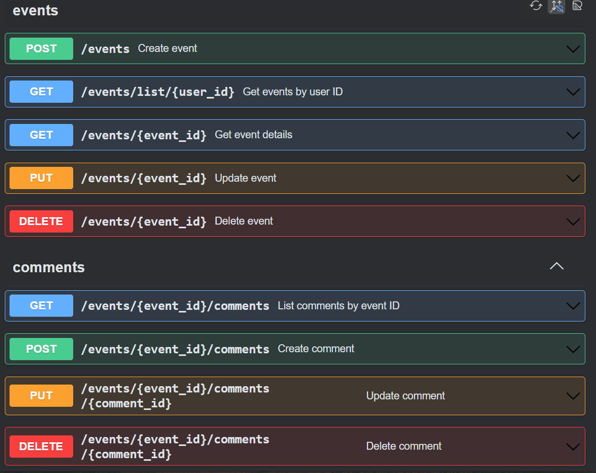
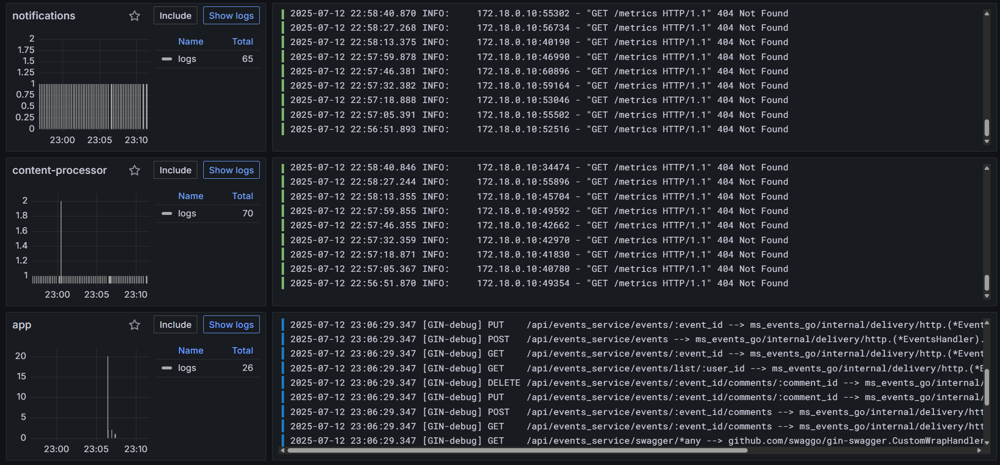

# 🌍 GeoAlbum

> Мобильное приложение для обмена медиа-контентом среди друзей на карте мира.

GeoAlbum — учебный проект по командной разработке продукта. Пользователи создают «события» с
фотографиями и видео, привязанные к точкам на карте, делятся ими с друзьями и получают
push-уведомления о новой активности. Серверная часть построена на **микросервисной архитектуре**,
клиент — кроссплатформенное **Flutter**-приложение.

<p align="center">
  
  
  
  
  
  
  
  
  
  
</p>

---

## 📑 Содержание

- [Возможности](#-возможности)
- [Архитектура](#-архитектура)
- [Технологический стек](#-технологический-стек)
- [Структура проекта](#-структура-проекта)
- [Компоненты системы](#-компоненты-системы)
- [Мобильное приложение](#-мобильное-приложение)
- [Запуск проекта](#-запуск-проекта)
- [Порты сервисов](#-порты-сервисов)
- [API-документация](#-api-документация)
- [Наблюдаемость (Observability)](#-наблюдаемость-observability)
- [CI/CD](#-cicd)
- [Команда](#-команда)

---

## ✨ Возможности

- 🗺️ **Карта контента** — события с фото и видео, привязанные к геолокации.
- 📸 **Загрузка медиа** — выбор и сжатие изображений/видео, хранение в объектном S3-хранилище.
- 👥 **Социальное взаимодействие** — друзья, профили, комментарии к событиям.
- 🔔 **Push-уведомления** — оповещения о новой активности через Firebase Cloud Messaging.
- 🔐 **Авторизация через Google** — OAuth 2.0 и JWT-токены (RS256).
- 📊 **Полная наблюдаемость** — логи, метрики, трейсинг и алертинг из коробки.

---

## 🏛 Архитектура

Все клиентские запросы проходят через единый **API Gateway** (OpenResty), который выполняет
JWT-аутентификацию и маршрутизацию к микросервисам. Сервисы общаются между собой асинхронно
через **Apache Kafka**, а вся телеметрия собирается стеком Grafana.


```mermaid
flowchart TD
    Mobile["📱 Flutter App"] -->|HTTPS / JWT| GW["🌐 API Gateway<br/>(OpenResty + Lua)"]

    GW --> Users["👤 MS Users<br/>(Java / Spring Boot)"]
    GW --> Events["📅 MS Events Go<br/>(Go / Gin)"]
    GW --> Content["🖼️ Content Processor<br/>(Python / FastAPI)"]
    GW --> Notify["🔔 Notification Backend<br/>(Python / FastAPI)"]

    Users --> UsersDB[("PostgreSQL")]
    Events --> EventsDB[("PostgreSQL")]
    Content --> ContentDB[("PostgreSQL")]
    Content --> S3[("☁️ S3 / Yandex Cloud")]
    Notify --> NotifyDB[("PostgreSQL")]

    Users -. publish .-> Kafka{{"📨 Apache Kafka"}}
    Events -. publish .-> Kafka
    Kafka -. consume .-> Notify
    Notify --> FCM["☁️ Firebase Cloud Messaging"]

    subgraph Observability["📊 Observability"]
        Prometheus --> Grafana
        Loki --> Grafana
        Tempo --> Grafana
    end

    GW -.metrics/logs/traces.-> Observability
```

**Ключевые принципы:**

- **Единая точка входа** — все запросы проходят аутентификацию на Gateway; публичный RSA-ключ
  используется для верификации JWT, выпускаемых сервисом пользователей.
- **Изоляция данных** — у каждого микросервиса собственная база PostgreSQL (database-per-service).
- **Событийная интеграция** — Kafka-топики `user.events`, `post.events`, `comments.events`,
  `notification.events` связывают сервисы без жёсткой зависимости.
- **Контейнеризация** — каждый сервис описан собственным `docker-compose` и общается через
  внешнюю Docker-сеть `shared_network`.

---

## 🧰 Технологический стек

| Компонент              | Технологии                                                                 |
|------------------------|----------------------------------------------------------------------------|
| **Mobile App**         | Flutter, Dart, flutter_map, firebase_messaging, google_sign_in             |
| **API Gateway**        | OpenResty (nginx + Lua), JWT-аутентификация                                |
| **MS Users**           | Java 21, Spring Boot 3.4, Spring Security, OAuth2, Spring Data JPA, Kafka   |
| **MS Events Go**       | Go 1.24, Gin, pgx, swaggo (Swagger), gomock                                |
| **Content Processor**  | Python 3.12, FastAPI, SQLAlchemy/SQLModel, Alembic, aioboto3 (S3)          |
| **Notification Backend** | Python 3.12, FastAPI, FastStream, aiokafka, async-firebase (FCM)         |
| **Базы данных**        | PostgreSQL                                                                 |
| **Брокер сообщений**   | Apache Kafka + Zookeeper                                                    |
| **Observability**      | Grafana, Prometheus, Loki, Tempo, Promtail, node-exporter                  |
| **Инфраструктура**     | Docker, Docker Compose, GitHub Actions                                      |

---

## 📁 Структура проекта

```
.
├── .github/
│   ├── readme_images/      # Скриншоты для документации
│   └── workflows/          # GitHub Actions (CI: ci.yml, CD: cd.yml)
├── gateway/                # API Gateway на OpenResty (nginx + Lua, JWT-аутентификация)
├── mobile_app/             # Кроссплатформенное Flutter-приложение
├── ms_users/               # Микросервис пользователей (Java / Spring Boot)
├── ms_events/              # Микросервис событий — Legacy (Java)
├── ms_events_go/           # Микросервис событий — актуальный (Go)
├── content_processor/      # Сервис обработки и хранения медиа (Python / FastAPI)
├── notification_backend/   # Сервис push-уведомлений (Python / FastAPI)
├── observability/          # Стек мониторинга (Grafana, Prometheus, Loki, Tempo)
└── start.sh                # Оркестратор запуска всех сервисов
```

---

## 🧩 Компоненты системы

### 🌐 Gateway

API Gateway на базе **OpenResty** — единая точка входа для всех клиентских запросов. Отвечает за:

- **Маршрутизацию** запросов к соответствующим микросервисам (reverse proxy).
- **Аутентификацию и авторизацию** — проверка JWT-токенов через Lua-скрипт (`lua/jwt_auth.lua`)
  с кешированием в `lua_shared_dict`.
- **Разделение публичных и защищённых маршрутов** — Swagger-документация и OAuth-эндпоинты
  доступны без токена, остальное — только авторизованным пользователям.
- **Структурированное логирование** запросов в формате JSON для дальнейшего сбора в Loki.

### 👤 MS Users

Микросервис управления пользователями (**Java 21 / Spring Boot**) отвечает за:

- Регистрацию и аутентификацию пользователей (**OAuth 2.0** через Google).
- Выпуск и подпись **JWT-токенов** (RS256).
- Управление профилями пользователей.
- Социальные связи между пользователями (друзья).
- Публикацию событий в Kafka.

### 📅 MS Events Go

Актуальная версия микросервиса управления событиями, переписанная на **Go** (заменяет
legacy-реализацию `ms_events`). Построена по слоистой архитектуре (`delivery` → `services` →
`repository`). Обеспечивает:

- CRUD-операции с событиями.
- CRUD-операции с комментариями к событиям.
- Интеграцию с Content Processor для привязки медиа.
- Swagger-документацию (`swaggo`) и покрытие тестами с использованием mock-генерации.

> **MS Events (Legacy)** — предыдущая реализация микросервиса событий на Java. Сохранена в
> репозитории для истории, но выведена из эксплуатации и не запускается в `start.sh`.

### 🖼️ Content Processor

Сервис обработки медиа-контента (**Python / FastAPI**) выполняет:

- Валидацию загружаемых файлов и проверку ограничений (constraints).
- Генерацию presigned-URL для прямой загрузки в объектное хранилище.
- Хранение медиа-контента в **S3-совместимом хранилище** (Yandex Cloud / AWS).
- Управление миграциями БД через Alembic.

### 🔔 Notification Backend

Сервис уведомлений (**Python / FastAPI + FastStream**) обеспечивает:

- Потребление событий из **Kafka** и преобразование их в уведомления.
- Отправку **push-уведомлений** через Google Firebase Cloud Messaging (FCM).
- Управление FCM-токенами устройств и подписками на уведомления.

---

## 📱 Мобильное приложение

Кроссплатформенное приложение на **Flutter** для конечных пользователей: интерактивная карта,
загрузка медиа, профиль, лента событий и push-уведомления.

#### Основные экраны приложения:

<table>
  <tr>
    <td align="center">
      <p><strong>Экран входа</strong></p>
      
    </td>
    <td align="center">
      <p><strong>Профиль пользователя</strong></p>
      
    </td>
  </tr>
  <tr>
    <td align="center">
      <p><strong>Карта контента</strong></p>
      
    </td>
    <td align="center">
      <p><strong>Выбор медиа-контента</strong></p>
      
    </td>
  </tr>
  <tr>
    <td align="center">
      <p><strong>Уведомления</strong></p>
      
    </td>
    <td align="center">
      <p><strong>Список созданных событий</strong></p>
      
    </td>
  </tr>
  <tr>
    <td align="center">
      <p><strong>Экран события</strong></p>
      
    </td>
    <td></td>
  </tr>
</table>

---

## 🚀 Запуск проекта

### Требования

- **Docker** и **Docker Compose**
- **Bash** (для запуска `start.sh`)
- Файлы окружения `.env` в каталогах сервисов (содержат секреты: ключи БД, OAuth, FCM, S3)

### Запуск всех сервисов

Скрипт `start.sh` создаёт общую Docker-сеть `shared_network` и поочерёдно поднимает каждый сервис
через его собственный `start.sh` / `docker-compose`:

```bash
chmod +x start.sh
./start.sh
```

Поднимаемые сервисы: `gateway`, `content_processor`, `ms_events_go`, `ms_users`,
`notification_backend`, `observability`.

### Запуск отдельного сервиса

Каждый сервис можно поднять независимо:

```bash
cd <service_dir>
docker compose up --build -d
```

### Мобильное приложение

```bash
cd mobile_app
flutter pub get
flutter run
```

---

## 🔌 Порты сервисов

| Сервис                       | Порт (host)        | Назначение                              |
|------------------------------|--------------------|-----------------------------------------|
| API Gateway                  | `80`               | Единая точка входа                      |
| Content Processor            | `8001`             | REST API обработки медиа                |
| MS Events Go                 | `8002`             | REST API событий                        |
| MS Users                     | `API_PORT` (.env)  | REST API пользователей                  |
| Notification Backend         | `8004`             | REST API уведомлений                    |
| Kafka                        | `9092` / `29092`   | Брокер сообщений (internal / external)  |
| Kafka UI                     | `8080`             | Веб-интерфейс Kafka                     |
| Grafana                      | `3000`             | Дашборды наблюдаемости                  |
| Prometheus                   | `9090`             | Сбор метрик                             |
| Loki                         | `3100`             | Агрегация логов                         |
| Tempo                        | `3200`             | Распределённый трейсинг                 |

> Внутри Docker-сети сервисы доступны по своим внутренним портам (например, Gateway проксирует
> запросы на `content-processor:8000`, `app:8080`, `ms_users_web:8080`, `notifications:8000`).

---

## 📖 API-документация

Основные микросервисы предоставляют **Swagger / OpenAPI**-документацию по пути `/docs`
(доступна без авторизации через Gateway):

| Сервис             | Документация                                   |
|--------------------|------------------------------------------------|
| MS Users           | `/api/users_service/docs`                      |
| MS Events Go       | `/api/events_service/docs`                     |
| Content Processor  | `/api/content_processor/docs`                  |
| Notification       | `/api/notifications/docs`                       |



---

## 📊 Наблюдаемость (Observability)

Полноценный стек мониторинга на базе **Grafana**, доступный через порт `3000`
(логин/пароль по умолчанию — `admin` / `admin`):

- **Prometheus** — сбор метрик сервисов, node-exporter и kafka-exporter.
- **Loki + Promtail** — централизованная агрегация логов контейнеров.
- **Tempo** — распределённый трейсинг запросов.
- **Grafana** — единые дашборды, визуализация и алертинг.



---

## ⚙️ CI/CD

Автоматизация на **GitHub Actions**:

- **CI** (`.github/workflows/ci.yml`) — при push и pull request в `main` / `dev` запускает
  линтинг и тесты для каждого сервиса: `golangci-lint` + `go test` (Events Go),
  `flake8` + `pytest` с покрытием через Codecov (Content Processor, Notifications),
  Gradle-тесты (MS Users).
- **CD** (`.github/workflows/cd.yml`) — ручной запуск (`workflow_dispatch`) на self-hosted
  runner, разворачивающий систему через `start.sh`.

---

## 👥 Команда

Список участников, внёсших вклад в различные компоненты системы:

| Компонент              | Автор                                            |
|------------------------|--------------------------------------------------|
| Gateway                | [@kestfor](https://github.com/kestfor)           |
| Mobile App             | [@kestfor](https://github.com/kestfor)           |
| MS Events Go           | [@kestfor](https://github.com/kestfor)           |
| MS Users               | [@JsJustS](https://github.com/JsJustS)           |
| MS Events (Legacy)     | [@nextples](https://github.com/nextples)         |
| Content Processor      | [@AntonAdonin](https://github.com/AntonAdonin)   |
| Notification Backend   | [@AntonAdonin](https://github.com/AntonAdonin)   |
| Observability          | [@AntonAdonin](https://github.com/AntonAdonin)   |

Изначальные наброски, user-story, agile-story и др. доступны на доске Miro:
<https://miro.com/app/board/uXjVIZNGeJc=/>